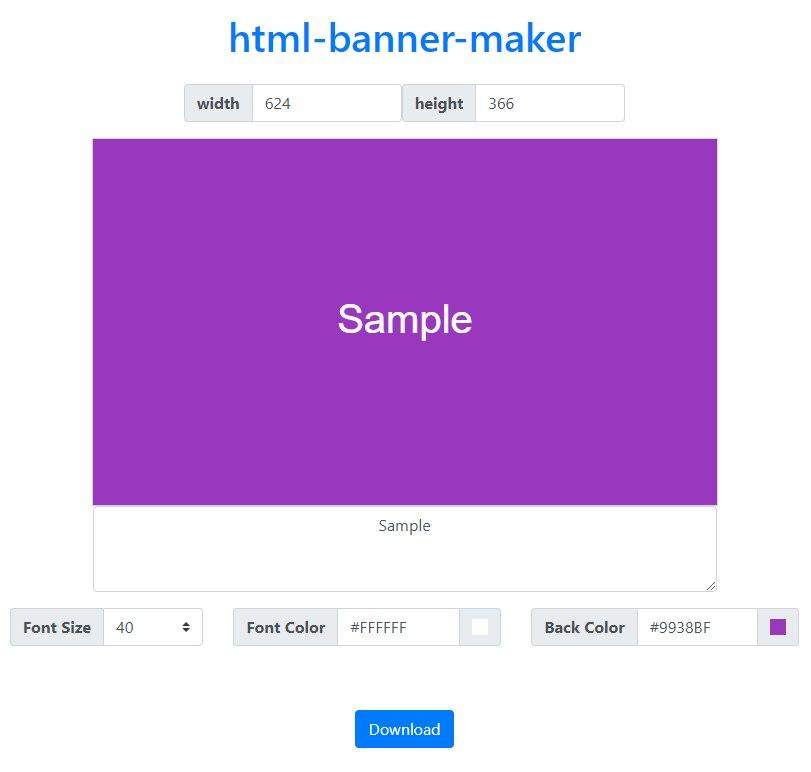

# html-banner-maker

- [Banner Maker](https://banner.godori.dev/)을 보고 만들어 보았습니다.

## [데모](https://chinsun9.github.io/html-banner-maker/)

[](https://chinsun9.github.io/html-banner-maker/)

## 기능

- 캔버스 크기 조절
- 실시간 캔버스 업데이트
- 폰트 사이즈 조절
- 폰트색 조절
- 캔버스색 조절
- 랜덤 캠버스색
- 이미지로 다운로드
- 클립보드로 카피

## Bootstrap

### Bootstrap css

```html index.html
<link
  rel="stylesheet"
  href="https://maxcdn.bootstrapcdn.com/bootstrap/4.0.0/css/bootstrap.min.css"
  integrity="sha384-Gn5384xqQ1aoWXA+058RXPxPg6fy4IWvTNh0E263XmFcJlSAwiGgFAW/dAiS6JXm"
  crossorigin="anonymous"
/>
```

- cdn으로 사용

### Bootstrap Color Picker

```
npm install bootstrap-colorpicker
```

- `node_modules\bootstrap-colorpicker\dist` 경로에서 소스 코드 가져와 사용
